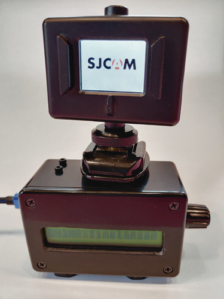

# Nano Timelapser

### A little funny device for helping with timelapse videos

## Preface

I found a 16x1 LCD module from my junkbox. I was wondering what to build with that. Then I saw a 
servo in another junkbox. I had made some timelapse videos with an IKEA kitchen timer and SJCAM 
SJ4000 (which has quite nice timelapse functionality), but that clock rotates only 
counterclockwise and with constant speed of 360 degrees per hour. So I decided to make a little 
more sophisticated device from my junkbox parts. As mentioned before, I found a standard Hitec 
HS-311 servo too. I also have a reserve of Arduino Nanos and basic rotary encoders.


## About the code

The LCD I had thinks it's a 8x2 display even it is 16x1 in the reality. So if longer than 8 
character string is written to the screen, only 8 first are displayed. The next 8 chars must be 
written on the line 2.  

The servo specifications should be checked and the code should be edited with correct values
of minimum and maximum &mu;s of the pulse. That is in the beginning of the code:

```
    #define MIN_US 575
    #define MAX_US 2460
```

## The schematic

The potentiometer 10k&Omega; and it is for LCD contrast. My display didn't have backlight LED, so 
it's not in the schematic either.

[](img/timelapser_schema_big.png)

## Operation

When power is plugged to the device, it first stands on the startup screen. When the switch
of the rotary encoder is pushed, it waits for the _end_ position where to turn. It can be
adjusted with the rotary encoder. Next the starting position can be set. Next is the duration
for the rotation. It works like eg. in a microwave oven, the bigger the time set is, the bigger
is the step. After that it waits for the final click and after it the rotation starts.





### Happy timelapsing.

